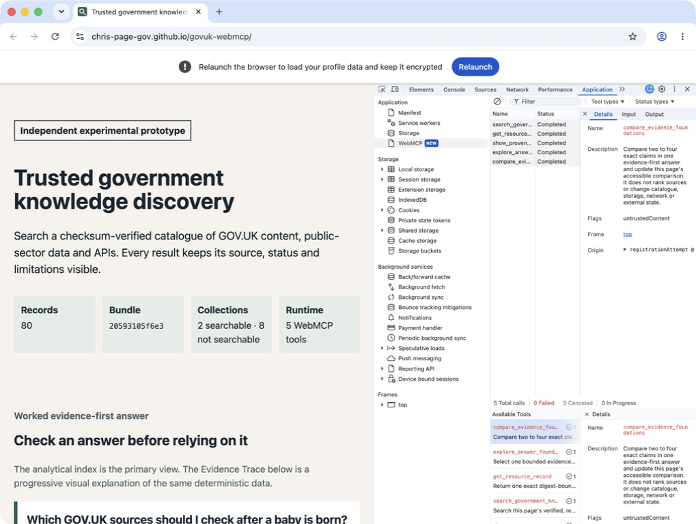
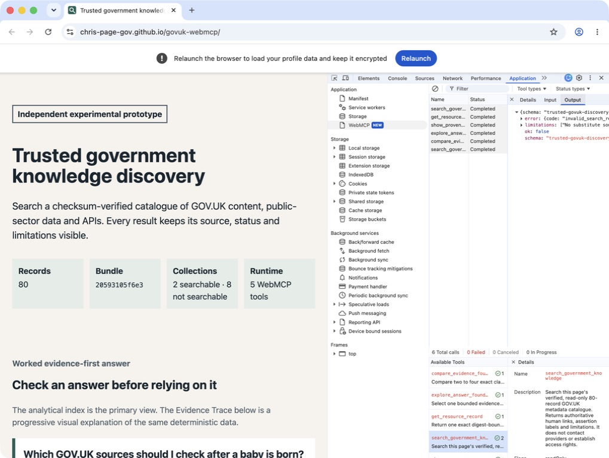

# Corrected public deployment and WebMCP verification — 30 August 2026

## Verified deployment boundary

- Public site: <https://chris-page-gov.github.io/govuk-webmcp/>
- Repository: `chris-page-gov/govuk-webmcp`
- Product commit: `edd4ce6b60c38c3c9fbac86408d6b58d1495671f`
- Pages run: `33323152751`
- Pages artefact: `9735478602`
- GitHub artefact API digest:
  `sha256:98b0641c6cdbfa444d7aee455976823a53b9d7ece97321ea0c01fa7ab4f942d0`
- Downloaded `artifact.tar` SHA-256:
  `bc7f2b34b376d425aaace8949eb5de4d8233fec232a02f8de1dd987813f6482f`
- Live `deployment.json` SHA-256:
  `4a4778dea35bb9e0ad0884291d6f1246fe0b26d0a94cdf472c3fff449469546e`

The live deployment metadata names the expected schema, repository, full
40-character commit and numeric Pages run. At `2026-08-30T16:44:23.237Z`, all
20 files fetched from the public site returned HTTP 200 and matched the
downloaded Pages artefact byte for byte. The complete observations are in
`live-artifact-verification-2026-08-30-edd4ce6.json`; the exact deployment
metadata bytes and file manifest are retained separately.

## Chrome DevTools MCP capture

The allowlisted public-target runner used Chrome DevTools MCP 1.8.0 with
Google Chrome 152.0.7977.64 in an isolated profile. It validated
`deployment.json` before starting Chrome, discovered the five closed-schema
tools, completed one call to each and recorded zero console errors. It also
submitted an unrelated `personalContext` field and retained the resulting
closed `invalid_search_request` envelope.

The ignored raw receipt has SHA-256
`5c6ae3d0f806e4d697e74cbeb69c27c697d47453a2f296284f675c4816b73704`.
`chrome-devtools-mcp-2026-08-30-edd4ce6.json` is its reviewed public
projection. It retains the exact tool definitions, inputs, result objects and
canonical result digests while omitting local profile paths, host page
identifiers, network headers and cookies.

| Tool | Status | Exact result schema | Canonical result SHA-256 |
| --- | --- | --- | --- |
| `search_government_knowledge` | Completed | `trusted-govuk-discovery.search-result.v1` | `6d4309f8dd859fde382a052e29fbc0f48ec1b33c6938e78e9d95ce5a728e53c2` |
| `get_resource_record` | Completed | `trusted-govuk-discovery.resource-record-result.v1` | `7a6b9a14afa8a21eadb082f8ad62b71ab1cf69c5ce1a6048665068ff12ebb869` |
| `show_provenance` | Completed | `trusted-govuk-discovery.provenance-result.v1` | `db5d93d8eb48ac7f18effdbb967a836a87cf40cb0d515957b5b0cc78f3f59838` |
| `explore_answer_foundations` | Completed | `trusted-govuk-discovery.evidence-exploration-result.v1` | `598e35479aa1336855e306483e249bb05696194f6d39eb0b26d7f369f143b717` |
| `compare_evidence_foundations` | Completed | `trusted-govuk-discovery.evidence-comparison-result.v1` | `3baa3281849855b86e929fd5fad8984580066ac4e275063341c1d9102dc903b1` |

The invalid call returned
`trusted-govuk-discovery.error.v1` with canonical SHA-256
`62c91b15cb26bcb89e2f19a404210f65e2ceb47f823f3c892cef36fb9a6ee02f`.

## Native Chrome DevTools panel capture

A separate disposable Chrome 152.0.7977.64 profile enabled `WebMCP`,
`DevToolsWebMCPSupport` and `WebMCPTesting`. Chrome's native
Application → WebMCP panel listed the exact five tools and recorded five
completed valid calls. The exploration call changed the reversible page
selection; the comparison call displayed 11 evidence-facet rows. A sixth call
with `limit: 21` reached the executable validator and returned the structured
`invalid_search_request` result with `ok: false`.

Playwright drove the native DevTools frontend through a loopback-only Chrome
DevTools Protocol attachment and used the panel's Paste and Run tool controls.
This was necessary because the macOS accessibility bridge exposed keyboard
focus but not a working pointer action for the tool cards. The browser surface
under test was Chrome's native panel, but the journey was automated. It was not
a model-backed run: no AI agent selected a tool and no model provider was
contacted.

The valid and invalid ignored native receipts have SHA-256 values
`79ffcccdf6f396509a06feb6dfbb3dd70421deccf957277c0b11e58acb86ced6`
and
`994899d50cc56ffa713fa1a12f84dac36d0b37d961aade8755d126f8be259367`.
The reviewed record is `native-devtools-webmcp-2026-08-30-edd4ce6.json`.

## Evidence boundaries

- These are time- and host-specific observations of experimental Chrome 152
  behaviour, not a general browser compatibility claim.
- Chrome DevTools MCP and the native-panel journey prove deterministic
  discovery and execution, not whether a model chooses the right tool.
- The native raw receipt retained collapsed output summaries. Exact results for
  the same public target and inputs are retained by the separate Chrome
  DevTools MCP capture; the native evidence does not claim a second byte-level
  result capture.
- Digest agreement proves byte identity, not factual completeness, official
  certification or future availability.
- The tools remain page-scoped progressive enhancement, not a durable
  government MCP service. Source-derived content is untrusted and the capture
  did not refetch or independently certify cited sources.
