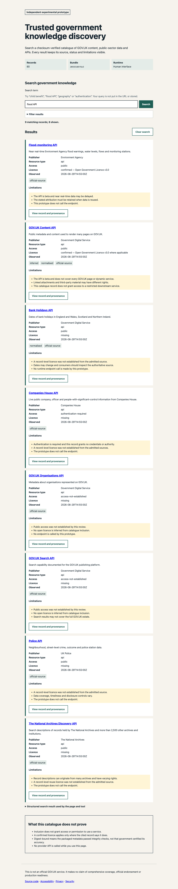

# Public release verification — 29 August 2026

## Verified release boundary

- Public repository: <https://github.com/chris-page-gov/govuk-webmcp>
- Release pull request: <https://github.com/chris-page-gov/govuk-webmcp/pull/7>
- Deployed site: <https://chris-page-gov.github.io/govuk-webmcp/>
- Deployed commit: `ef3b6f496924250c5dfb9cc52ea124468035a3dc`
- Exact-main validation run: `33276000462`
- Pages deployment run: `33276042312`
- Catalogue SHA-256: `3590646185b609ddfabef70798928164ebe8136000d82540e22f73aa43660a3e`

The pull request was rebase-merged through protected `main`. The exact-main
validation and manually dispatched Pages workflow passed. The deployed
`deployment.json` names the same commit and Pages run. The deployed catalogue
sidecar and a fresh local SHA-256 calculation agree.

## Signed-out HTTP checks

Unauthenticated requests returned HTTP 200 for the public repository, top-level
MIT licence and GitHub Pages root. The Pages response used HTTPS and included
HTTP Strict Transport Security. No account or application credential is needed
for the static journey.

## Controlled live-browser journey

The live site loaded in the Codex in-app browser control session. A search for
`flood API` reported 9 matches and displayed the configured first 8. The first
result linked to the authoritative API catalogue entry and displayed publisher,
resource type, access, licence, observation date, assertions and limitations.
All 10 observed requests were successful same-origin static requests. The
browser console contained no error or warning.

This browser session did not expose `document.modelContext`. The human journey
therefore passed, but this observation does not prove WebMCP registration or
tool calls in ChatGPT's supported built-in-browser judging environment. That
host-specific test remains open and must use the exact final candidate URL.

## Repository controls read back from GitHub

`main` requires an up-to-date `validate` status and a pull request, dismisses
stale reviews, enforces the rules for administrators, requires linear history
and resolved conversations, and rejects force pushes and deletion. The
`github-pages` environment admits protected branches only. Vulnerability alerts,
automated security fixes and private vulnerability reporting are enabled.

Zero required approvals is intentional for this sole-maintainer repository:
the pull-request and status-check boundary remains enforceable without creating
an unavailable second-reviewer gate.

## Limitations

- This verifies availability and artefact identity at the recorded time, not
  future availability.
- Digest agreement proves package integrity, not publisher certification.
- No manual screen-reader or touch-device observation was performed.
- Competition registration, video publication and Devpost submission were not
  performed.
