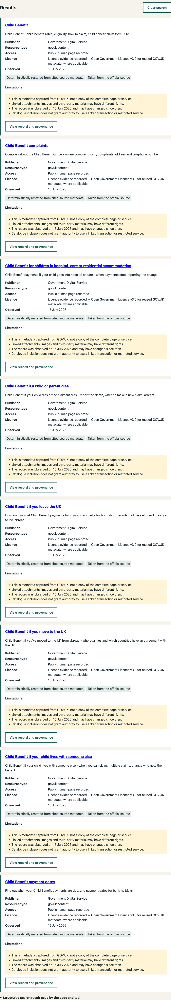

# Public release verification — 30 August 2026

## Verified release boundary

- Public repository: <https://github.com/chris-page-gov/govuk-webmcp>
- Implementation pull request: <https://github.com/chris-page-gov/govuk-webmcp/pull/9>
- Product commit: `9235ee5db4df637bdb2a12e87449e871614afe68`
- Annotated tag: `v0.2.0-rc.1`, tag object
  `0a41f7a6f0123c3aba9742bbf6167b8a8ceb2b82`
- Public pre-release: <https://github.com/chris-page-gov/govuk-webmcp/releases/tag/v0.2.0-rc.1>
- Deployed site: <https://chris-page-gov.github.io/govuk-webmcp/>
- Pull-request validation run: `33286703184`
- Exact-main validation run: `33286750188`
- Pages deployment run: `33286771963`

Pull request 9 was rebase-integrated through protected `main` at 01:54:49 UTC.
The pull-request check passed on its head commit. The canonical push check then
passed on the exact product commit, including 58 unit tests and 19 Chromium
browser tests. The Pages workflow rebuilt and retested that same commit before
deployment.

The release tag resolves to the product commit. The tagger identity is Chris
Page's personal GitHub no-reply identity; the tag is annotated but not
cryptographically signed. GitHub records the pre-release as published at
02:06:00 UTC. The final annotated tag object was created at 02:08:40 UTC after
the tag reference was replaced to correct the tagger identity; the product
commit and deployed bytes did not change.

## Pages artefact and live-byte verification

The successful Pages run produced Actions artefact `9724680702`, reported by
GitHub as 87,370 bytes with digest
`sha256:30c449112aff09872f4a3a0a0213fc0508c279ec434788245902bbf64696a80a`.
The downloaded archive contained a 675,840-byte `artifact.tar` with SHA-256
`1276135cdbe707ef7fd0dc96db80d078f5fa7c772ae87b83ee49f8ee694c35f5`.

All 20 files extracted from that archive were fetched again from the public
site with a cache-busting query at 02:07:04 UTC. Every response returned HTTP
200 and matched the corresponding artefact file byte for byte. The complete
file manifest is in `site-SHA256SUMS-2026-08-30`; the structured observations
are in `live-artifact-verification-2026-08-30.json`.

The live `deployment.json` names repository `chris-page-gov/govuk-webmcp`,
commit `9235ee5db4df637bdb2a12e87449e871614afe68` and run
`33286771963`. Its exact response bytes are preserved as
`live-deployment-metadata-2026-08-30.json`.

Key live SHA-256 values were:

- catalogue: `969d703663887c7d50a3ee36287988a748441c33bd50ab3c625e7d2525a555e1`;
- receipts: `8dc4838366f69f3906dfe092ce88c7134ab8d1cf144d6e0a37aa9e03c142dfa4`;
- Evidence Trace: `f54af026d72c3e902039cae04e5e58067c39b33cf86d93f70a8075f9c4c1d8c0`;
- federation: `0b56592fb95b29512c73485aac0ce06f0644cc78c07a68504a0f63b597259adc`;
- compiled WebMCP runtime: `50910cd47e3f1a977ebd8014b711c0964fe4c2c61049f8173f763786da684327`.

## Signed-out live-browser journey

A fresh headed Chromium session loaded the public site without an account or
application credential. The page showed 80 verified records, two searchable
collections, eight non-searchable admission records and the catalogue bundle
prefix. A human search for `child benefit` returned 69 matches and displayed
the configured first eight.

The first result linked to the authoritative GOV.UK Child Benefit page and
showed publisher, resource type, public human-page access, licence evidence,
15 July 2026 observation date, assertion basis and four limitations. The query
was not placed in the URL. No cookie, local storage or session storage entry was
created. The browser console reported no error or warning. All eight observed
data requests were successful same-origin requests.

The browser did not expose `document.modelContext`. The human journey therefore
passed, while native WebMCP discovery and tool invocation in a supported host
remain unobserved.

## Repository controls read back from GitHub

The public `main` branch requires a pull request and an up-to-date `validate`
check, dismisses stale reviews, enforces the rules for administrators, requires
linear history and resolved conversations, and rejects force pushes and branch
deletion. Zero required approvals remains intentional for the sole maintainer.
GitHub secret scanning and push protection are enabled for the public
repository.

## Evidence boundary and limitations

The machine-readable `challenge-provenance.json` observes an earlier immutable
product commit. It does not claim to be contained in that product commit; its
repository binding is supplied externally by the protected commit that
eventually contains it. At the time this record was created, that integration
had not occurred.
`SHA256SUMS` correctly excludes itself to avoid a circular digest.

- Availability and response headers are observations at the recorded time, not
  promises of future availability.
- Digest agreement proves artefact identity, not publisher certification or
  factual completeness.
- The local macOS ARM64 CycloneDX file remains a dependency view, not a
  release-platform SBOM or signed attestation.
- No manual screen-reader or touch-device observation was performed.
- No supported-host native WebMCP call was observed.
- No video was published and no Devpost registration or submission was
  performed by this release workflow.
